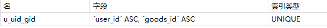

# 如何应对高并发：缓存、异步、分布式


# 项目开发环境与框架搭建

## 技术

前端：Thymeleaf、Bootstrap、JQuery

后端：SpringBoot、JSR303、MyBatis

中间件：RabbitMQ、Redis、Druid


## 项目结构

1. 分布式会话
2. 商品列表页
3. 商品详情页
4. 订单详情页
5. 系统压测
6. 缓存优化
7. 消息队列
8. 接口安全


## 项目目录

java

- access（拦截器，访问限制，防刷限流）
- config（自定义参数解析器）
- controller
- dao（配置MyBatis，增删改查）
- domain（实体对应数据库表）
- exception（全局异常处理）
- rabbitmq（消息队列）
- redis（缓存）
- result（返回值的封装，json格式）
- service
- util（工具包）
- validator（参数校验，自定义参数校验）
- VO（前端交互数据）
- MainApplication.java（主程序）

resources

- static（静态资源）
- templates（前端页面）
- application.properties(配置文件)
  - server.port=8080
  - thymeleaf
  - log
  - redis
  - rabbitmq
  - mybatis
  - druid


## SpringBoot三种创建方式

service之间可以相互调用，service只能调用自己的dao

**前端页面-controller-service-dao-返回VO给前端**


## SpringBoot集成功能

- pom.xml引入**dependency**
- application.properties配置文件**添加配置**


## Controller作用

- REST API ，REST风格的HTTP接口
  - **约定输出格式**，如json交互数据
- 页面
  - 返回String，表示页面名称


## REST风格

一种软件架构风格，基于HTTP，可以使用XML格式定义或JSON格式定义

- 特点：
  - **URL描述资源**
    - URL中只使用**名词**来**定位资源**
  - 使用HTTP方法**描述行为**
    - 用HTTP协议里的**动词**（GET、POST、PUT、DELETE）来实现资源的增删改查操作。
  - 使用HTTP**状态码来表示不同的结果**
  - 使用**Json/XML**交互数据
- 好处：
  - 隐藏资源访问行为
  - 简化开发


## 基于SpringBoot创建REST风格接口

- @RestController
  - 类上面加注解，返回Json格式数据；
- 下面四个注解加在方法上面
  - @PostMapping ("/URL")，用于增加数据
  - @GetMapping (/URL)，用于查询数据
  - @DeleteMapping("/URL")，用于删除数据
  - @PutMapping (/URL)，用于更新数据

- 封装**Result**，返回结果

  - code，**HTTP状态码**来表示不同的结果
    - 2xx = Success（成功）
    - 3xx = Redirect（重定向）
    - 4xx = User error（客户端错误）
    - 5xx = Server error（服务器端错误）

  - msg，结果信息说明

  - data，json对象或者数组


## 配置数据源druid

- ip+端口号（3306）+数据库名字

- ```
  spring.datasource.url=jdbc:mysql://localhost:3306/miaosha
  ```

- 数据库用户和密码


## 集成thymeleaf

- 配置文件路径，前缀、后缀

- ```
  spring.thymeleaf.prefix=classpath:/templates/
  spring.thymeleaf.suffix=.html
  ```

- ${value}，表示从服务端取值


## 集成MyBatis（dao）

- 可以配置xml

- 也可以使用注解

  - @Mapper

  - @Select()、@Insert()、@Update()、@Delete()
  
  - **参数获取方式：#{name}**
- @Insert()，获取返回值
  - 用到**@SelectKey注解**
    - keyColumn="id"，数据库列
    - keyProperty="id"，doman类实例字段
    - resultType=long.class，返回类型
    - before=false，插入数据后返回
    - statement="**select last_insert_id**"，查询上次插入数据的id


## 集成Redis

- ```
  redis.host=localhost
  redis.port=6379
  ```

- redisConfig

- Jedis连接池

- 重写set、get方法
  - key-value
  - 过期时间（自定义0，永不过期）
  - 缓存中存储的数据大小不一、作用不同，为了区分不同作用的缓存，防止不同模块的key重复覆盖数据，在 key 值前加了标识
  - 真正的 Key 值为“**类名：prefix+key**”
  
- 重写incr（增加值）、decr（减少值）方法
  - 原子操作
  - 数值操作，加减1
  - 若是其它类型，默认为0，再加减1


# 登录功能

## 数据库设计

秒杀商品单拉出来一张表，秒杀活动是商家的营销活动，为了避免频繁的对商品表更改，所以秒杀商品表独立出来，通过商品 id 关联商品表。

- goods(商品)
- miaosha_goods((**秒杀商品**)
- miaosha_order(**秒杀订单**)，唯一索引（user_id、goods_id）
  - 
- miaosha_user(**秒杀用户**)
  - 密码、salt
- order_info(**订单信息**)
- user(用户)


## 明文密码两次MD5处理

1. 用户端：PASS=MD5(明文+固定Salt)
   - 用户输入密码，经过一次MD5密码，传到服务端
2. 服务端：PASS=MD5(加盐明文密码+随机Salt)
   - 服务端获取MD5密码，salt从数据库取，二次MD5和数据库密码对比


## JSR303参数检验

当然用户有可能输入格式错误，或者密码不正确，前端、后端都需要进行验证

前端提交的数据，封装成VO（**@Valid** LoginVo loginVo）

VO字段加上**注解**，做参数校验

校验失败**抛出异常BindException**


**原生注解**

- @NotNull
- @Max

**自定义注解**

- constraint  附加到字段，getter 方法，类或者接口上面
- 前端传入数据时，就会触发这个注解，执行里面的方法
- 例如自定义注解：@**IsMobile**
  - boolean required() default **true**，是否需要参数校验
  - String **message**() default "手机号码格式错误"，信息说明
- IsMobile接口名上加上@@Constraint(validatedBy = {**IsMobileValidator**.class })
- **IsMobileValidator**需要实现**ConstraintValidator**接口，写验证逻辑
  - initialize，是否需要参数校验，true则执行isValid
  - isValid，验证逻辑
    - 获得前端传的值，进行正则校验，校验通过返回 true，什么都不做
    - 否则返回 flase，**抛出异常**


## 全局异常处理器

业务逻辑代码出现异常，**抛出GlobalException异常**，异常处理器统一返回**Result**


**自定义异常类**

标准异常无法描述清楚的问题，可以自定义异常类，向上报告某些错误信息


**自定义全局异常类**，继承**RuntimeException**类，如：

- public class **GlobalException** extends **RuntimeException**


**全局异常拦截**（异常拦截、**处理**）

```java
@ControllerAdvice
@ResponseBody
public class GlobalExceptionHandler {
	@ExceptionHandler(value=Exception.class)
	public Result<String> exceptionHandler(HttpServletRequest request, Exception e){
		异常处理逻辑，异常信息封装到Result，返回给前端
	}

}
```


## 分布式 session

分布式 session 是一个概念，实际存储的是 cookie

- 登陆成功后生成 token（UUID），来标识用户，把 token 写进 **cookie**
- 客户端在随后的访问中都在 cookie 中上传 token，服务端取到 token，根据 token 取得对应的用户信息

**实际信息存储在缓存**

- 当需要用到时可以直接从缓存中取出来，极大的减少了冗余的代码，也减少了每次对数据的访问
- token放到**缓存**中，key为token，value为用户信息，设置有效期
- token写到**cookie**中，key自定义，value为token（response返回cookie），设置有效期


**延长有限期**

- 登录成功以后返回两个token：一个是accesstoken，另一个是refreshtoken
- 当用户带着accesstoken来访问的时候，并不去刷新accesstoken
- 而是提供一个refreshToken的方法，让客户端**定时来调用**，调用的时候需要传递refreshToken
- 这样，就可以最大限度的减少accessToken的刷新。


## 参数解析器 ArgumentResolver

其它方法之所以能够直接获取用户信息，是因为我们做了自定参数解析器

- 实现 HandlerMethodArgumentResolver接口
- 注册参数解析器

当然 SpringBoot 也有预先设置好的参数，如：

- HttpServletRequest 、 HttpServletResponse 
- @RequestParam 、 @RequestHeader 、@RequestBody、@PathVariable、@ModelAttribute 等

当方法被调用时，首先会判断该方法是否用到了预先定义好的参数，然后回调方法给对象赋值。

我们自定义的参数解析器也是如此。

- **使用对象**
- **回调方法**
- **对象赋值**


自定义参数解析器，然后添加到config（注册）

```java
@Service
public class UserArgumentResolver implements HandlerMethodArgumentResolver {
	@Override
	public boolean supportsParameter(MethodParameter parameter) {
		return false;
	}
	@Override
	public Object resolveArgument(MethodParameter parameter, ModelAndViewContainer mavContainer, NativeWebRequest webRequest, WebDataBinderFactory binderFactory) throws Exception {
		return null;
	}
}
```


# 实现秒杀功能

## **页面**

- 登录页面
  - 登录成功后，跳转商品列表

- 商品列表页
  - 加载商品信息

- 商品详情页
  - 根据商品id查出商品信息
  - 返回VO（包括rmiaoshaStatus、emainSeconds）
  - 前端根据数据展示秒杀按钮，点击开始秒杀

- 订单详情页


## 秒杀页面设置

后端返回秒杀状态**miaoshaStatus**，前端根据秒杀状态，设置页面：

- 状态码 0， 未开始，**倒计时** 
- 状态码 1， 已开始，显示秒杀按钮 
- 状态码 2 ，已结束 

**剩余时间** **remainSeconds**

页面加载时，获取remainSeconds 的值

- 未开始，remainSeconds = 开始时间-当前时间
  - **禁用秒杀按钮，显示倒计时**
  - 设置定时器，回调函数，一秒一次，修改remainSeconds 值
  - 直到 remainSeconds  = 0
  - 清除设置定时器，则**修改页面**，**启用秒杀按钮**
- 已开始，remainSeconds = -1，启用秒杀按钮
- 已结束 ，remainSeconds = 0，禁用秒杀按钮


**倒计时功能**

```
<span th:if="${user eq null}"> 您还没有登录，请登陆后再操作<br/></span>

        	<input type="hidden" id="remainSeconds" th:value="${remainSeconds}" />
        	<span th:if="${miaoshaStatus eq 0}">秒杀倒计时：<span id="countDown" th:text="${remainSeconds}"></span>秒</span>
        	<span th:if="${miaoshaStatus eq 1}">秒杀进行中</span>
        	<span th:if="${miaoshaStatus eq 2}">秒杀已结束</span>
```


## 秒杀业务逻辑

点击秒杀按钮，传递商品ID， 秒杀商品，form表单提交到后端

1. 判断库存
2. 是否重复秒杀
   1. 查询订单信息。如存在，则表示已经秒杀过了

3. **减库存、下订单、写入秒杀订单（事务）**
   1. 传入参数（user，goods）用户秒杀商品
   2. 秒杀成功后，生成订单信息，包含两个
      1. 订单详细信息
      2. 秒杀订单信息，包括**user_id、order_id、goods_id**，便于设置唯一索引（user_id、goods_id）

4. 支付模块


# 页面优化

- 页面缓存+URL缓存（Thymeleaf）
- 对象缓存
- 页面静态化，前后端分离
- 静态资源优化
- CDN优化


## 缓存

**页面缓存**

- 从缓存中取html源代码，非空返回(**缓存命中**)
- 若缓存为空(**缓存失效**)
  - **手动渲染**
    - thymeleafViewResolver.getTemplateEngine，模板引擎
    - WebContext，包含业务数据
  - 同时添加页面缓存，页面缓存有效期（比如60秒）
  - 返回html源代码
- 页面缓存，一般**有效期比较短**，保证数据及时性

```java
    @RequestMapping(value = "/to_list", produces = "text/html")
    @ResponseBody
    public String list(HttpServletRequest request, HttpServletResponse response, Model model, MiaoshaUser user) {
        model.addAttribute("user", user);
        // 取缓存
        String html = redisService.get(GoodsKey.getGoodsList, "", String.class);
        // 缓存非空，返回
        if (!StringUtils.isEmpty(html)) {
            return html;
        }
        // 缓存为空
        List<GoodsVo> goodsList = goodsService.listGoodsVo();
        // return "goods_list";
        model.addAttribute("goodsList", goodsList);
		// 业务数据
        WebContext ctx = new WebContext(request, response,
                request.getServletContext(), request.getLocale(), model.asMap());
        //手动渲染
        html = thymeleafViewResolver.getTemplateEngine().process("goods_list", ctx);
        if (!StringUtils.isEmpty(html)) {
            redisService.set(GoodsKey.getGoodsList, "", html);
        }
        // 返回html
        return html;
    }
    }
```


**URL缓存**

- 和页面缓存类似，例如
  - 页面缓存商品列表，无参数
  - URL缓存商品详情，接口有ID参数，ID不同商品详情不同

- 参数不同，页面信息不同

- 页面缓存、url缓存有效期比较短，**适用于页面变化不大的场景**（如商品列表，商品列表有分页，只缓存前几页）


**对象级缓存**

- 更细颗粒度的缓存，比如：
  - 登录成功时，**用户信息**写入缓存
    - 服务端通过token获取

  - 秒杀成功生成订单时，**订单信息**写入缓存
    - 查询是否已经秒杀过时，查缓存，不查数据库，减少负载

- 数据更新时，也要处理缓存

  1. 先更新数据库
  2. 再让缓存失效（删除、更新）


## Cache Aside [Pattern](https://blog.csdn.net/tTU1EvLDeLFq5btqiK/article/details/78693323)

- 失效：应用程序先从cache取数据，没有得到，则从数据库中取数据，成功后，放到缓存中。
- 命中：应用程序从cache中取数据，取到后返回。
- 更新：先把数据存到数据库中，成功后，再让缓存失效。
  - 试想，两个并发操作，一个是更新操作，另一个是查询操作
  - 更新操作删除缓存后，查询操作没有命中缓存，先把老数据读出来后放到缓存中，然后更新操作更新了数据库。
  - 于是，在缓存中的数据还是老的数据，导致缓存中的数据是脏的。


## 前后端分离

1. 常用技术：AngularJS、Vue.js、React
2. 优点：**利用浏览器的缓存**

**前后端分离**

- 静态数据缓存，动态数据调接口
- 页面静态化，html、css、js、image缓存到浏览器端
- 动态数据通过服务端获取
- 不需要使用页面缓存和URL缓存了，浏览器端已经进行了缓存，再用页面缓存和URL缓存没有什么意义
- **对象缓存可以继续使用**
- 前后端分离后，**不经过服务端，客户端直接跳转到商品详情页面**，然后商品详情页面Ajax请求动态数据


**商品详情静态化**、**订单详情静态化**

- 使用jquery模拟，不使用thymeleaf

- 商品详情使用原生html，页面跳转时，直接跳转到html页面
- 然后Ajax请求动态数据，jquery填充页面
- 同时根据miaoshaStatus、remainSeconds，修改页面


**秒杀接口前后端分离**

后端仅返回给前端所需的数据，**不再渲染 HTML 页面**，不再控制前端的效果。

前端得到数据，自己渲染。

**前端和后端只关注于自己的逻辑判断和控制**。后端仅需提供给前端 API 即可。

- 不需要表单提交
- 直接按钮 **onclick** ，ajax请求数据
- post请求


**get、post区别**

- 传参方式，GET放在url后面，post放在http的body，GET参数直接暴露在 URL 中，传参更不安全
- 参数长度，浏览器对url后面的参数长度有限制，post也有限制，但是post要比get大得多
- GET的页面可以被缓存，添加收藏，POST不可以
- GET可以后退刷新，POST刷新会重新提交数据
- GET不能做文件上传，POST可以。
- 以上都是表象，最根本的区别是**语义区别**：
  - GET的语义是**请求获取指定的资源**
    - GET方法是安全（不修改资源）、幂等、可缓存的（除非有 Cache-ControlHeader的约束）
  - POST的语义是根据请求报文对**指定的资源做出处理**，具体的处理方式视资源类型而不同
    - POST不安全（修改资源），不幂等，（大部分实现）不可缓存
  - 简单地说**GET是获取数据，POST是修改数据**
  - Restful规范里面，GET是获取，POST是添加，PUT是修改，DELETE是删除。


**静态文件配置**

- 配置静态文件路径
- 不配置，304（前后端仍然交互了一次）
- 配置后，200（静态文件直接从浏览器取缓存，不需要访问服务器，减少交互）
- 配置后，减少前后端交互
- Cache-Control：max-age=**3600**，缓存时间


## 静态资源优化

- JS/CSS压缩，减少流量

- 多个JS/CSS组合，减少连接数

- CDN就近访问

  

**tengine**

- 组合多个CSS、JS文件的访问请求变成一个清求
- 自动去除**空白字符和注释**从而减小页面的体积（webpack工具，打包）


**CDN**

全称是Content Delivery Network，**内容分发网络。**根据用户位置等，访问最近的镜像

- 可以将网站的**静态资源**（如图片、CSS、JavaScript 等文件）缓存到全球各地的服务器上
- 当用户请求这些资源时，可以**从离用户最近的服务器上获取资源，从而提高资源的访问速度和用户的访问体验**。

CDN 的主要作用是：

- 提高网站的访问速度
- 降低带宽成本
- 提高可用性

同样，在高并发场景下，CDN 可以发挥重要的作用。

由于高并发场景下会有大量的用户同时访问网站，如果所有的请求都直接访问源站，就会导致源站的带宽和服务器资源受到过大的压力，从而导致网站的访问速度变慢或者出现宕机等问题。

因此，在高并发场景下，**使用 CDN 可以将流量分散到全球各地的服务器上，从而减轻源站的压力，提高网站的访问速度和可用性**。


# 接口优化

并发大问题，**瓶颈在于数据库**，思路：**减少数据库访问**。解决：

- **各种缓存，减少数据库负载**
- **接口优化：减少数据库访问**

- **数据库分库分表（mycat中间件）**


## 方案

1. Redis预减库存减少数据库访问
2. 内存标记减少Redis访问
3. 请求先入队缓冲，异步下单，增强用户体验
4. Nginx水平扩展


## 思路

1. 系统初始化，把商品库存数量加载到Redis
2. 收到请求，Redi**s预减库存**，库存不足，直接返回，否则进入3
3. 请求入队，立即返回**排队中**
4. 请求出队，生成订单，减少库存
5. 客户端轮询，是否秒杀成功


**加载库存**

- 实现 **InitializingBean**接口，覆写**afterPropertiesSet**(）方法
- 系统初始化调用此方法，**加载库存、内存标记到缓存**


**内存标记**

- **减少redis负载**
- 访问秒杀接口时，先访问redis内存标记，若为true，则直接返回，商品卖完啦
- 设置redis内存标记
- 初始化为 **false**，放到缓存中
- redis库存小于0时，设置为**true**


**入队缓冲**

- 库存足够，没有秒杀过，进入下个步骤，入队
- 用户，商品id（用户秒杀商品）作为消息，发送消息到队列
- 消息接受者监听接收消息，**异步下单**
  1. 判断数据库库存（是否库存大于0）
  2. 判断是否已经秒杀到了（是否存在秒杀订单）
  3. 减库存（成功才下单）
  4. 下订单
  5. 写入秒杀订单（唯一索引）


**轮询**

- 秒杀成功后，返回排队中，**前端开始轮询**（类比12306买票，不马上返回是否抢票成功，显示正在排队中）

- 先判断是否存在订单 order，存在，表示秒杀成功，返回 orderId

- 若order==null，判断缓存标记

- 缓存标记 == false，表示没有卖完，继续轮询，返回 0

- 缓存标记 == true，表示卖完啦，返回  -1

  - orderId：成功

  - 0： 排队中
  - -1：秒杀失败
    - 设置一个缓存标记(false)
    - **减库存时**，若**库存为0**时，设置缓存表示已经秒杀完毕，修改缓存标记(true)
    - 轮询时，若缓存标记为true，则卖完啦，返回秒杀失败 -1


## RabbitMQ

- **同步直接调用**转换成**异步间接推送**，把瞬时并发的**大量请求平推出去**，削弱峰值

- 秒杀请求过来时，先入队缓冲瞬时流量，直接返回客户端正在排队中
- 然后出队，生成订单，修改库存
- 同时客户端定时轮询，定时查询是否秒杀成功
- 出队和轮询同时进行


**配置**

- 创建队列
- 创建交换机
- 队列和交换机**绑定（routingKey）**

创建消息发送者

- 发送消息到**队列或交换机**

创建消息接受者

- ```java
  @RabbitListener(queues=队列名字/交换机名字)
  ```

- **监听**队列或交换机，接受消息

**消息传播**：**消息->交换机->队列**


**Exchange**

交换机和队列绑定（Key、无key、key-value）

发送消息到交换机，匹配成功，队列才会收到消息

四种交换机模式：

- Direct Exchange：按照**routingkey**分发到指定队列
- Topic Exchange，**多关键字匹配**，发给多个队列，交换机和队列通过**routingkey**绑定
  - 发送消息到交换机时，交换机key和队列key若**匹配**，则消息发送到队列
- Fanout Exchange，**广播模式**，**无routingkey的概念**，和交换机绑定的队列都能获得消息
- Headers Exchange ，交换机和队列通过**key-value绑定**
  - 发送消息时，**key-value匹配**，队列全部满足或者满足任何一个，队列才会收到消息


# 安全优化

## 方案

1. 秒杀接口地址隐藏（**防止明文暴露**，提前抢票、黄牛机器人抢票）
2. 数学公式验证码（**保护获取秒杀地址的接口，分散请求**）
3. 接口限流防刷（保护，防止恶意刷接口）


前端页面限制，防君子不防小人，主要防止用户出错

Http明文，url可以提前拿到，防止恶意刷接口


## 思路

点击秒杀之前，先输入验证码，分散用户的请求

1. 添加生成验证码的接口
2. 在获取秒杀路径的时候，验证验证码
3. ScriptEngine使用


## 秒杀接口地址隐藏

**思路：秒杀开始之前，先去请求接口获取秒杀地址**

1. 秒杀接口改造，带上PathVariable参数
2. 添加生成地址的接口
3. 秒杀收到请求，先验证PathVariable

**获取秒杀地址的接口也可能暴露，通过验证码验证**


**逻辑：**请求生成地址接口、返回path、秒杀接口**拼接path**（真正接口）、访问真正秒杀接口、先验证path


隐藏秒杀地址可以有很多种实现方式，上述只是一种实现方式，还可以：

- 接口可以返回302，跳转到新的页面，新的页面才是真正的秒杀页面
  - 接口可以返回一个页面的url，让浏览器跳转到这个新的url页面，新的页面才是真正的秒杀页面
  - **活动开始前和活动开始后是两个完全不同的页面**，**这样就可以防止提前抓取网页了**
- 为了防止恶意用户提前抓取网页，对网页进行分析，然后写出刷接口的机器人工具。
- 活动开始之前，恶意用户就算分析网页写了刷接口的程序也没用，因为那个页面并不是真正的秒杀页面。


## 数学公式验证码

**思路：点击秒杀之前，先输入验证码，分散用户的请求，防止机器人**

1. 添加生成验证码的接口（答案写入缓存）
2. 在点击秒杀**获取路径**的时候，**去验证验证码**（防止暴露获取动态路径 path 的地址）
3. ScriptEngine使用


**逻辑：**

1. 页面生成验证码，同时验证码答案写入缓存（key+uerId+goodsId，有效时间）
2. 用户输入验证码
3. 点击按钮，访问生成地址接口（获取秒杀路径）
4. 验证，用户输入和缓存验证
5. 验证成功后**删掉缓存**（防止再次使用）
6. 然后**生成path**（验证成功后，才生成path），返回
7. 访问真正秒杀接口


**使用验证码目的**

1. 防止机器人，刷票软件；
2. 延缓请求，**错峰请求**秒杀接口；
3. 保护作用，验证码不对，直接返回错误代码。
4. 防止 获取秒杀地址接口 暴露


## 接口限流防刷

**拦截器和缓存实现**，设置缓存，有效期内限制访问次数；过期失效，重新限制

- 首先自定义方法**注解**，放到秒杀接口的方法上
- 接着注册**拦截器**并覆写方法
- 服务器接到请求时，拦截器会先拦截请求，并获得注解
- 然后在覆写的方法中进行逻辑判断


**逻辑：**

- 查询访问次数（查询缓存）
- 为null，设置缓存
- 不为null
  - 小于等于限制次数，+1
  - 大于限制次数，返回失败


**拦截器写通用方法**

- 自定义注解，接口加上注解

- ```java
  // 5秒钟，最大访问次数限制5次，需要登录
  @AccessLimit(seconds=5, maxCount=5, needLogin=true)
  ```

- ```java
  @Retention(RUNTIME)
  @Target(METHOD)
  public @interface AccessLimit {
     int seconds();
     int maxCount();
     boolean needLogin() default true;
  }
  ```

- **自定义拦截器**，获取注解信息，进行限制
- 拦截器在参数解析器前执行，都需要在WebMvcConfigurer中注册
- ThreadLocal，存放数据到当前线程，每个线程单独一份


## 常见的限流算法

常见的限流算法：

最常用限流算法的就是使用**令牌桶或者漏斗桶算法**

常见的实现方式：

1. 在**网关**上做限流。比如在nginx上写lua脚本来实现
2. 在应用上做**单机**限流。使用诸如基于Guava的RateLimiter令牌桶的方式。
3. 在应用上做分布式限流。比如redisson提供了个基于redis的RateLimiter：
4. https://github.com/redisson/redisson/wiki/6.-distributed-objects#612-ratelimiter
5. 如果是SpringCloud项目，可用的就更多了，比如SpringCloud **Gateway**，Sentinel等等。


# 服务端优化

## Tomcat

**内存优化**

- -Xms2048M 最小内存，-Xmx2048M 最大内存都设为 2G；
- -XX:+HeapDumpOnOutOfMemoryError;
- -XX:HeapDumpPath=$CATALINA_HOME/logs/heap.dump";
- 内存溢出时，将内存映像放到$CATALINA_HOME/logs/heap.dump 文件，方便定位问题。

**并发优化**

- maxConnections：服务器支持最大并发连接数量
- acceptCount：当服务器的并发连接数都在使用时，会有一个队列来存放新来的请求，队列满时接收到的任何请求都将被拒绝
- maxThreads：最大工作线程数
- minSpareThreads：最小空闲的工作线程
- autoDeploy： 指 Tomcat 在运行时是否应该定期检查新的或更新的 web 应用程序，禁用提高性能。
- reloadable：监视 WEB-INF/classes/ and /WEB-INF/lib 中的类，并在检测到更改时自动重新加载 web 应用程序，可以设置为 true/false。

**APR 优化**

Tomcat 的 BIO、NIO、APR 模式，默认 NIO 模式

- APR：Apache HTTP 服务器的支持库。可以简单地理解为，Tomcat 将以 JNI 的形式调用 Apache HTTP 服务器的**核心动态链接库**来**处理文件读取或网络传输操作**，从而大大地提高 Tomcat 对**静态文件的处理性能**。Tomcat APR 也是在 Tomcat 上运行高并发应用的首选模式。

## nginx


反向代理

- 反向代理到集群（server_pool_miaosha;），配置多台服务器（localhost、otherserver等）


负载均衡

- 服务器按照权重分配请求数量，如上图，weight=1，均分请求
- max_fails=2，最大失败次数，判断服务器是否存活，超过次数，认为服务器挂掉，不会分配请求了


## LVS

LVS四层负载均衡，一台Nginx不够的话，引入LVS

## keepalive

负载均衡与高可用


# 压测

## **压测环境**

- 10 件商品，5000 个请求，并发 10 次，50000 并发量
- 阿里云服务器单核 2G
- QPS，Query Per Second，数据库每秒执行的SQL(含insert、select、,update、delete等)
- TPS，Transaction Per Second，数据库每秒执行的事务数，以commit为准


## 未优化前QPS变化

**测试秒杀接口**

前端：thymeleaf

- QPS：161/sec
- Average：0.223722秒，访问页面的平均响应时间
- 大概花费了 20 分钟
- 一共 10 件商品，卖出了 198 件
  - 库存只有一个的时候，有多个线程，同时减库存下订单，库存减为负数
- Redis 负载太大，阿里云服务器单核 2G，连接超时，获取不到资源

## 接口优化后QPS变化

**测试秒杀接口**

前后端分离

- QPS：971/sec
- Average：0.003572秒，访问页面的平均响应时间
- 大概了 45 秒
- 没有卖超
- Redis  连接正常


并发为 5000 时 Error%为 0%，QPS 为403.2/sec，并发为 7868 左右开始 Error%率开始上升，QPS 为 491.8/sec。

系统没有返回异常信息，日志文件（spring.log 文件）也是正常输出 INFO 等级的日志。说明系统在正常运行，无异常发生。

聚合报告之所以存在 Error%率，是因为系统使用的单核服务器，且单台机器的 QPS 是有限的，超出了机器的处理能力就会报错。

此次压测显示，单核 2G 的阿里云服务器的 QPS 极限大概在 500/sec 左右。


## 对比

和未优化之前对比，主要提升如下：

1. **商品没有超卖**，没有透传 DB
2. **能面对高并发业务场景**，且**没有造成系统故障**，发生事故
3. **响应时间**提升了几十倍，能够快速响应用户
4. **下载流量少**
5. QPS提升了大概 6 倍，**性能得到了很大提高**
